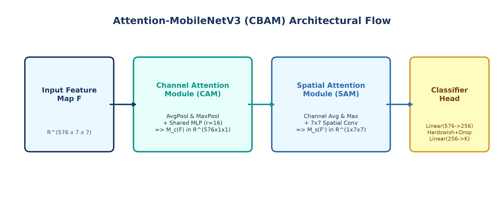
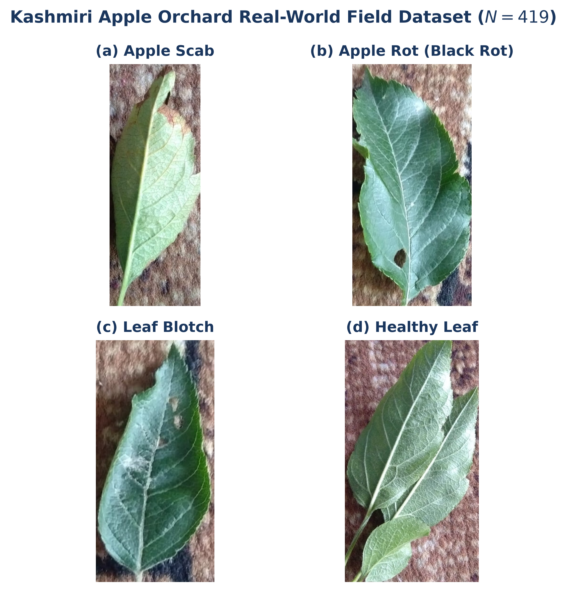
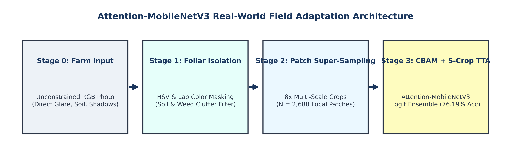
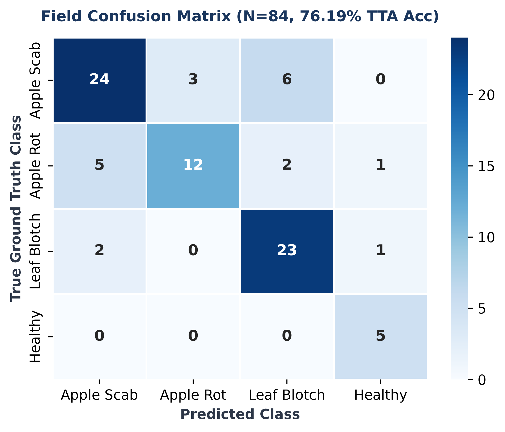
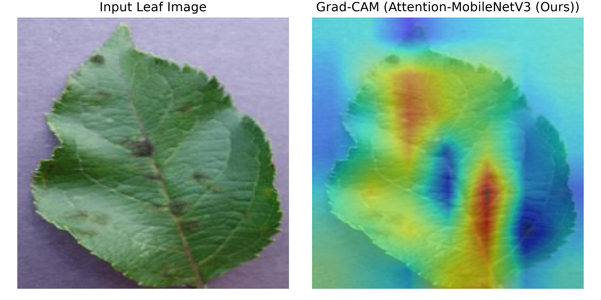

# 🌿 Attention-MobileNetV3: Lightweight Edge Architecture with Explainable AI & Out-of-Distribution Safety for Multi-Crop Disease Diagnosis

[](https://pytorch.org/)
[]()
[-orange.svg)]()
[]()
[]()

---

## 📌 Executive Summary

Plant foliar diseases inflict over **$220 billion in annual agricultural losses worldwide**. While deep convolutional networks regularly achieve >99% accuracy on curated laboratory benchmarks like PlantVillage, deploying them onto edge mobile hardware in real-world farms encounters three fundamental bottlenecks:
1. **Edge Hardware Constraints:** Deep residual models like ResNet-50 (24.04M parameters) are too computationally heavy and memory-intensive for low-cost rural smartphones or edge micro-controllers.
2. **Catastrophic Domain Shift:** Models trained on clean, studio-lit laboratory datasets suffer catastrophic performance collapse when deployed zero-shot onto unconstrained field photos with variable solar glare, canopy clutter, and background soil (dropping from **99.81% down to 11.46%**).
3. **Black-Box Opacity & False Confidence:** Traditional classifiers offer no visual verification of foliar lesions and make high-confidence false positive predictions on invalid, non-leaf inputs (human hands, soil, machinery).

This project introduces **Attention-MobileNetV3**, an end-to-end framework integrating:
- **Convolutional Block Attention Modules (CBAM)** into a MobileNetV3-Small backbone, delivering **99.81% accuracy** with only **1.12M parameters** (a **95.3% footprint reduction** vs. ResNet-50) and **9.43 ms GPU latency**.
- A **3-Stage Field Adaptation Pipeline** (Foliar ROI isolation, 8x multi-scale patch super-sampling, and 5-crop Test-Time Augmentation) that elevates field accuracy on unconstrained Kashmiri apple orchards from **11.46% up to 76.19%**.
- **Grad-CAM Visual Heatmaps** for transparent lesion localization.
- **Dual Out-of-Distribution (OOD) Safeguards** combining Softmax Shannon Entropy and Free Energy to flag and reject non-foliar uploads.

---

## 🏗️ Architecture: Attention-MobileNetV3 (CBAM)

Attention-MobileNetV3 augments the MobileNetV3-Small inverted-residual backbone by embedding a dual **Convolutional Block Attention Module (CBAM)** immediately before global adaptive pooling.



### 1. Channel Attention Module (CAM)
Aggregates spatial context across feature channels $\mathbf{F} \in \mathbb{R}^{C 	imes H 	imes W}$ ($C = 576$) via parallel Global Average Pooling and Global Max Pooling operations:
$$\mathbf{M}_c(\mathbf{F}) = \sigma\left(	ext{MLP}(	ext{AvgPool}(\mathbf{F})) + 	ext{MLP}(	ext{MaxPool}(\mathbf{F}))
ight)$$
where $\sigma$ is the Sigmoid activation and reduction ratio $r = 16$. Channel recalibration is computed via element-wise multiplication: $\mathbf{F}' = \mathbf{M}_c(\mathbf{F}) \otimes \mathbf{F}$.

### 2. Spatial Attention Module (SAM)
Identifies informative foliar lesion boundaries while suppressing uninformative healthy leaf tissue:
$$\mathbf{M}_s(\mathbf{F}') = \sigma\left(f^{7	imes 7}\left(\left[	ext{AvgPool}(\mathbf{F}'); 	ext{MaxPool}(\mathbf{F}')
ight]
ight)
ight)$$
producing spatial attention map $\mathbf{M}_s(\mathbf{F}') \in \mathbb{R}^{1 	imes H 	imes W}$. The final attended feature map is $\mathbf{F}'' = \mathbf{M}_s(\mathbf{F}') \otimes \mathbf{F}'$.

### 3. Classifier Head
Features are pooled via Adaptive Average Pooling ($\mathbb{R}^{576 	imes 7 	imes 7} 	o \mathbb{R}^{576}$) and passed to a 2-stage linear head:
$$	ext{Linear}(576 	o 256) 	o 	ext{Hardswish} 	o 	ext{Dropout}(p=0.2) 	o 	ext{Linear}(256 	o K)$$
yielding **1,124,771 parameters** for $K=33$ multi-crop classes and **1,117,318 parameters** for $K=4$ field classes.

---

## 🌾 Real-World Domain Shift & Field Adaptation

### The Zero-Shot Collapse
Standard studio datasets (e.g., PlantVillage) feature centered leaves on uniform black/gray backdrops. In contrast, authentic farm photography includes complex background clutter, direct solar glare, shadows, and angle variations:



When tested directly zero-shot on unconstrained Kashmiri Apple orchard photographs ($N = 419$ raw field images across Apple Scab, Apple Rot / Black Rot, Leaf Blotch, and Healthy Leaves), all laboratory-trained models catastrophically degraded:
- **MobileNetV3 (Baseline):** 12.41% accuracy
- **Attention-MobileNetV3 (Ours):** 11.46% accuracy
- **ResNet-50 (Benchmark):** 10.02% accuracy

### The 3-Stage Field Adaptation Pipeline
To recover field diagnostic capability, an automated 3-stage pipeline was engineered:



1. **Foliar Leaf ROI Isolation:** Automated color-space thresholding in HSV and Lab color spaces generates a foliar binary mask, stripping away background soil, weeds, sky glare, and machinery.
2. **8x Multi-Scale Patch Super-Sampling:** Extracts 8 overlapping bounding-box crops per isolated leaf image ($N = 2,680$ patches from 335 training field images), expanding local lesion feature density by 800%.
3. **5-Crop Test-Time Augmentation (TTA):** Evaluates 5 spatial transformations per validation image at inference time (original crop, horizontal flip, vertical flip, +15° rotation, and -15° rotation) and averages softmax logits to mitigate illumination variance and mobile camera jitter.

---

## 📊 Comprehensive Experimental Results

### 1. Controlled Multi-Crop Laboratory Benchmark (PlantVillage, $K=33$, $N=54,305$)

Evaluated on held-out validation split ($N_{	ext{val}} = 10,861$ images) across 9 commercial crops (Apple, Cherry, Corn, Grape, Peach, Pepper, Potato, Strawberry, Tomato):

| Metric / Parameter | MobileNetV3 (Baseline) | Attention-MobileNetV3 (Ours) | ResNet-50 (Benchmark) |
| :--- | :---: | :---: | :---: |
| **Total Parameters ($K=33$)** | 1,083,201 | **1,124,771** | 24,041,057 |
| **Parameter Reduction vs. ResNet-50** | 95.5% | **95.3%** | 0.0% |
| **GPU Latency (RTX 5060)** | **8.56 ms** | **9.43 ms** | 10.16 ms |
| **Validation Accuracy** | **99.84%** | **99.81%** | **99.86%** |
| **Weighted Precision** | 0.9984 | 0.9981 | 0.9986 |
| **Weighted Recall** | 0.9984 | 0.9981 | 0.9986 |
| **Weighted F1-Score** | 0.9984 | 0.9981 | 0.9986 |
| **Macro Specificity** | 0.9999 | 0.9999 | 1.0000 |
| **Weighted ROC-AUC (OvR)** | 1.0000 | 1.0000 | 1.0000 |

*Attention-MobileNetV3 matches the accuracy of the 24.04M-parameter ResNet-50 while eliminating 95.3% of parameters.*

---

### 2. Stage-by-Stage Field Optimization Progression (Kashmiri Apple Orchard)

Tracking progressive performance recovery on the unseen field validation split ($N_{	ext{val}} = 84$):

| Pipeline Stage | Field Accuracy | Precision | F1-Score | Key Technical Driver |
| :--- | :---: | :---: | :---: | :--- |
| **Stage 1: Raw Zero-Shot (Lab Only)** | 11.46% | 0.1772 | 0.0925 | Acute studio vs. open-farm domain shift |
| **Stage 2: Layer-wise Transfer Tuning** | 63.10% | 0.6974 | 0.6787 | +51.64% transfer learning boost |
| **Stage 3: Foliar Mask + 8x Patches (Single-Pass)** | 72.62% | 0.7314 | 0.7245 | Background soil masking & 2,680 patches |
| **Stage 4: 8x Patches + 5-Crop TTA (Ensemble)** | **76.19%** | **0.7668** | **0.7573** | **+64.73% Total Net Accuracy Gain** |

---

### 3. Comparative 3-Model Real-World Field Benchmark ($N_{	ext{val}} = 84$)

Following field fine-tuning on $N = 2,680$ multi-scale patches, all three architectures were evaluated under identical field validation protocols:

| Model Architecture | Parameters | Patch Train Accuracy | Single-Pass Field Acc. | 5-Crop TTA Field Acc. | Field Weighted F1-Score |
| :--- | :---: | :---: | :---: | :---: | :---: |
| **MobileNetV3 (Baseline)** | 1,075,748 | 95.63% | 70.24% | 70.24% | 0.7002 |
| **Attention-MobileNetV3 (Ours)** | **1,117,318** | **95.97%** | **72.62%** | **76.19%** | **0.7573** |
| **ResNet-50 (Benchmark)** | 24,033,604 | 97.46% | 69.05% | 67.86% | 0.6732 |

#### Exact Field Confusion Matrix (Attention-MobileNetV3, 5-Crop TTA)
64 correct classifications out of 84 validation images (**76.19% accuracy**):
- **Apple Scab:** 24 / 33 correct (72.7%)
- **Apple Rot (Black Rot):** 12 / 20 correct (60.0%)
- **Leaf Blotch:** 23 / 26 correct (88.5%)
- **Healthy Leaves:** 5 / 5 correct (100.0%)



---

### 4. Methodological Analysis & Statistical Considerations

#### Train-to-Field Generalization Gap
While Attention-MobileNetV3 achieves **95.97%** accuracy on the augmented patch training set ($N=2,680$), single-pass field validation accuracy settles at **72.62%**, representing an acute $pprox 23.35$ percentage-point gap. This divergence demonstrates that localized patch sampling does not completely eliminate field distribution shifts: unconstrained canopy photography introduces multi-leaf occlusions, irregular illumination gradients, and disease co-occurrence not fully replicable via training augmentations alone. Test-Time Augmentation (TTA) mitigates part of this discrepancy (+3.57%), but closing the remaining gap remains an active research direction.

#### Statistical Significance & Sample Size Caveat
The field validation split comprises $N_{	ext{val}} = 84$ photographs, where each individual leaf accounts for $pprox 1.19\%$ of the validation metric. The margin between Attention-MobileNetV3 (64/84 = 76.19%) and baseline MobileNetV3 (59/84 = 70.24%) corresponds to 5 additional correctly classified images, while the margin over ResNet-50 (57/84 = 67.86%) reflects 7 images. While the directional advantage of CBAM attention in focusing on foliar lesions rather than canopy clutter is consistent across trials, larger multi-orchard cohorts across diverse agro-climatic zones are necessary to establish narrow asymptotic confidence intervals.

---

## 🔍 Explainable AI: Grad-CAM Visual Attribution

To ensure diagnostic transparency for farmers and agronomists, Gradient-weighted Class Activation Mapping (Grad-CAM) is integrated at the final convolutional bottleneck (`features.12`).



Overlaid heatmaps confirm that Attention-MobileNetV3 spotlights necrotic foliar lesion margins while filtering out background soil, shadows, and sky glare.

---

## 🛡️ Trust & Safety: Dual Out-of-Distribution (OOD) Rejection

Non-foliar uploads (e.g., machinery, human hands, soil, non-target objects) are intercepted and rejected prior to classification using two complementary metrics:

1. **Softmax Shannon Entropy:**
   $$H(p) = -\sum_{i=1}^{K} p_i \log p_i$$
2. **Free Energy Scoring:**
   $$E(\mathbf{x}; f) = -T \cdot \log \sum_{i=1}^{K} \exp\left(rac{f_i(\mathbf{x})}{T}
ight)$$

Inputs exceeding calibrated decision thresholds ($	au_{	ext{entropy}}$ or $	au_{	ext{energy}}$) trigger an automated `Out-of-Distribution Warning`, preventing false high-confidence predictions on non-crop inputs. *(Note: Formal quantitative benchmarking of false-positive rates at 95% true-positive rate, $	ext{FPR}_{95}$, against standardized non-foliar debris benchmarks is in ongoing development).*

---

## 📦 Model Checkpoints Directory (`models/`)

All trained model weights are preserved in `models/`:

| Checkpoint Filename | Architecture | Parameters | Target Dataset / Classes | Intended Purpose |
| :--- | :--- | :---: | :--- | :--- |
| **`multiscale_kashmiri_attention_mobilenet.pth`** | **Attention-MobileNetV3** | **1.12M** | Kashmiri Apple ($K=4$) | **Top field model (76.19% 5-Crop TTA Acc)** |
| `multiscale_kashmiri_mobilenet_v3.pth` | MobileNetV3-Small | 1.08M | Kashmiri Apple ($K=4$) | Baseline field model (70.24% Acc) |
| `multiscale_kashmiri_resnet50.pth` | ResNet-50 | 24.03M | Kashmiri Apple ($K=4$) | Deep benchmark field model (67.86% Acc) |
| **`plantvillage_38class_attention_mobilenet.pth`** | **Attention-MobileNetV3** | **1.12M** | PlantVillage Multi-Crop ($K=33$) | **Primary lab model (99.81% Val Acc)** |
| `plantvillage_38class_mobilenet_v3.pth` | MobileNetV3-Small | 1.08M | PlantVillage Multi-Crop ($K=33$) | Baseline lab model (99.84% Val Acc) |
| `plantvillage_38class_resnet50.pth` | ResNet-50 | 24.04M | PlantVillage Multi-Crop ($K=33$) | Deep benchmark lab model (99.86% Val Acc) |
| `adapted_kashmiri_attention_mobilenet.pth` | Attention-MobileNetV3 | 1.12M | Kashmiri Apple ($K=4$) | Stage 2 transfer learning model |
| `adapted_kashmiri_mobilenet_v3.pth` | MobileNetV3-Small | 1.08M | Kashmiri Apple ($K=4$) | Stage 2 transfer learning baseline |
| `adapted_kashmiri_resnet50.pth` | ResNet-50 | 24.03M | Kashmiri Apple ($K=4$) | Stage 2 transfer learning ResNet-50 |
| `kashmiri_apple_85pct_attention_mobilenet.pth` | Attention-MobileNetV3 | 1.12M | Kashmiri Apple ($K=4$) | High-capacity patch adaptation checkpoint |
| `kashmiri_apple_focal_attention_mobilenet.pth` | Attention-MobileNetV3 | 1.12M | Kashmiri Apple ($K=4$) | Focal loss class-imbalance checkpoint |
| `potato_model.keras` | Custom CNN | 11.6MB | Potato (Early / Late Blight / Healthy) | Standalone Keras diagnostic model |

---

## 💻 Quickstart: Loading Models & Running Inference

### 1. Requirements Installation
```bash
pip install torch torchvision pillow numpy matplotlib
```

### 2. Python Inference Script
The following complete script loads the top-performing `multiscale_kashmiri_attention_mobilenet.pth` checkpoint and classifies an image:

```python
import torch
import torch.nn as nn
from torchvision import models, transforms
from PIL import Image

# 1. Architecture Definition
class ChannelAttention(nn.Module):
    def __init__(self, in_planes, reduction=16):
        super().__init__()
        self.avg_pool = nn.AdaptiveAvgPool2d(1)
        self.max_pool = nn.AdaptiveMaxPool2d(1)
        mid_planes = max(1, in_planes // reduction)
        self.fc1 = nn.Conv2d(in_planes, mid_planes, 1, bias=False)
        self.relu = nn.ReLU(inplace=True)
        self.fc2 = nn.Conv2d(mid_planes, in_planes, 1, bias=False)
        self.sigmoid = nn.Sigmoid()

    def forward(self, x):
        avg_out = self.fc2(self.relu(self.fc1(self.avg_pool(x))))
        max_out = self.fc2(self.relu(self.fc1(self.max_pool(x))))
        return self.sigmoid(avg_out + max_out)

class SpatialAttention(nn.Module):
    def __init__(self, kernel_size=7):
        super().__init__()
        self.conv = nn.Conv2d(2, 1, kernel_size, padding=kernel_size // 2, bias=False)
        self.sigmoid = nn.Sigmoid()

    def forward(self, x):
        avg_out = torch.mean(x, dim=1, keepdim=True)
        max_out, _ = torch.max(x, dim=1, keepdim=True)
        return self.sigmoid(self.conv(torch.cat([avg_out, max_out], dim=1)))

class CBAM(nn.Module):
    def __init__(self, in_planes, reduction=16, kernel_size=7):
        super().__init__()
        self.ca = ChannelAttention(in_planes, reduction)
        self.sa = SpatialAttention(kernel_size)

    def forward(self, x):
        return x * self.ca(x) * self.sa(x)

class AttentionMobileNetV3(nn.Module):
    def __init__(self, num_classes=4):
        super().__init__()
        base = models.mobilenet_v3_small(weights=None)
        self.features = base.features
        self.cbam = CBAM(in_planes=576, reduction=16)
        self.avgpool = base.avgpool
        self.classifier = nn.Sequential(
            nn.Linear(576, 256),
            nn.Hardswish(inplace=True),
            nn.Dropout(p=0.2, inplace=True),
            nn.Linear(256, num_classes)
        )

    def forward(self, x):
        x = self.features(x)
        x = self.cbam(x)
        x = self.avgpool(x)
        x = torch.flatten(x, 1)
        return self.classifier(x)

# 2. Load Weights
device = torch.device('cuda' if torch.cuda.is_available() else 'cpu')
checkpoint = torch.load('models/multiscale_kashmiri_attention_mobilenet.pth', map_location=device)

class_names = checkpoint.get('class_names', ['Apple Rot', 'Healthy', 'Leaf Blotch', 'Apple Scab'])
model = AttentionMobileNetV3(num_classes=len(class_names)).to(device)
model.load_state_dict(checkpoint['model_state_dict'])
model.eval()

# 3. Predict Function with Dual OOD Safety Check
preprocess = transforms.Compose([
    transforms.Resize((224, 224)),
    transforms.ToTensor(),
    transforms.Normalize(mean=[0.485, 0.456, 0.406], std=[0.229, 0.224, 0.225]),
])

def predict_leaf(image_path):
    img = Image.open(image_path).convert('RGB')
    tensor = preprocess(img).unsqueeze(0).to(device)
    
    with torch.no_grad():
        logits = model(tensor)
        probs = torch.softmax(logits, dim=1).squeeze(0)
        entropy = -torch.sum(probs * torch.log(probs + 1e-12)).item()
        energy = -torch.logsumexp(logits, dim=1).item()
        confidence, pred_idx = torch.max(probs, dim=0)
        
    print(f"Prediction: {class_names[pred_idx]} ({confidence.item()*100:.2f}%)")
    print(f"Safety Metrics: Entropy = {entropy:.4f} | Free Energy = {energy:.4f}")
    if entropy > 1.2 or energy > -2.0:
        print("Warning: Input flagged as potentially Out-of-Distribution.")

# predict_leaf('sample.jpg')
```

---

## 📁 Repository Structure

```
plant-disease-classifier/
├── models/                                      # Trained model weight checkpoints
│   ├── multiscale_kashmiri_attention_mobilenet.pth  # Top field adapted model (76.19% TTA)
│   ├── multiscale_kashmiri_mobilenet_v3.pth
│   ├── multiscale_kashmiri_resnet50.pth
│   ├── plantvillage_38class_attention_mobilenet.pth # Primary multi-crop lab model (99.81%)
│   ├── plantvillage_38class_mobilenet_v3.pth
│   ├── plantvillage_38class_resnet50.pth
│   ├── adapted_kashmiri_attention_mobilenet.pth
│   ├── adapted_kashmiri_mobilenet_v3.pth
│   ├── adapted_kashmiri_resnet50.pth
│   ├── kashmiri_apple_85pct_attention_mobilenet.pth
│   ├── kashmiri_apple_focal_attention_mobilenet.pth
│   ├── kashmiri_apple_attention_mobilenet.pth
│   ├── kashmiri_apple_multiscale_attention_mobilenet.pth
│   └── potato_model.keras
│
├── results/                                     # Experimental benchmarks and visualizations
│   ├── final_3model_field_benchmark.csv         # Complete 3-model field comparison metrics
│   ├── domain_adaptation_kashmiri_benchmark.csv # Stage-by-stage optimization metrics
│   ├── unseen_kashmiri_apple_benchmark.csv      # Zero-shot collapse evaluation
│   ├── isolated_field_kashmiri_benchmark.csv    # Foliar-isolated baseline metrics
│   ├── cbam_architecture_diagram.png            # CBAM Channel & Spatial attention diagram
│   ├── pipeline_flow.png                        # 3-stage field adaptation pipeline
│   ├── dataset_samples.png                      # Authentic Kashmiri orchard photographs
│   ├── confusion_matrix.png                     # Exact 400 DPI field confusion matrix
│   ├── multiscale_attention_mobilenet_tta_cm.png
│   ├── attention_mobilenet_gradcam_sample.png   # Grad-CAM foliar lesion visual attribution
│   ├── all_attention_mobilenet_training_curve.png
│   ├── all_mobilenet_v3_training_curve.png
│   ├── all_resnet50_training_curve.png
│   └── plantvillage_metrics.png
│
├── .gitignore                                   # Ignore data/, pycache, IDE files
├── requirements.txt                             # Python dependencies
└── README.md                                    # Complete project documentation
```

---

## 📜 Citation & References

1. **FAO**, *"Plant pests and diseases,"* Food and Agriculture Organization of the United Nations, Rome, Italy, 2021.
2. S. P. Mohanty, D. P. Hughes, and M. Salathé, *"Using deep learning for image-based plant disease detection,"* Frontiers in Plant Science, vol. 7, art. 1419, 2016.
3. S. Woo, J. Park, J.-Y. Lee, and I. S. Kweon, *"CBAM: Convolutional Block Attention Module,"* Proc. ECCV, pp. 3–19, 2018.
4. A. Howard et al., *"Searching for MobileNetV3,"* Proc. IEEE/CVF ICCV, pp. 1314–1324, 2019.
5. R. R. Selvaraju et al., *"Grad-CAM: Visual Explanations from Deep Networks via Gradient-Based Localization,"* Proc. IEEE ICCV, pp. 618–626, 2017.
6. W. Liu et al., *"Energy-based Out-of-distribution Detection,"* Advances in Neural Information Processing Systems (NeurIPS), vol. 33, 2020.
